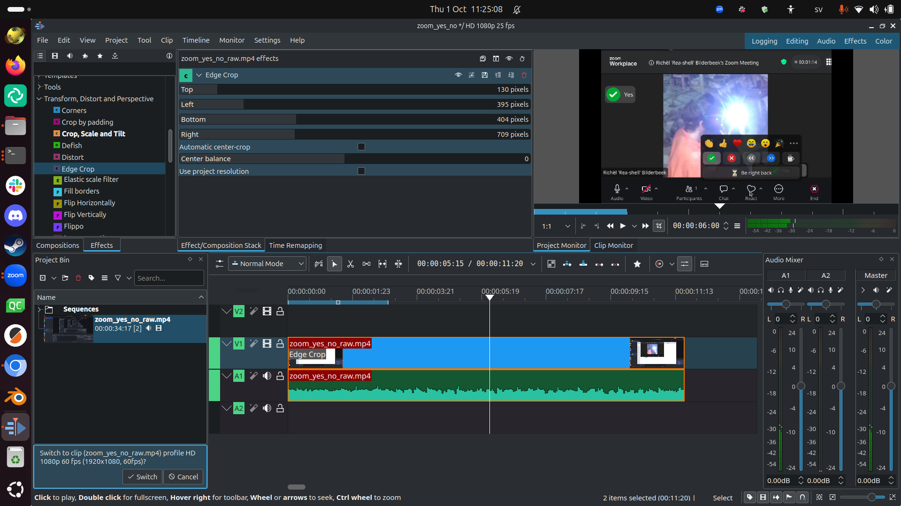
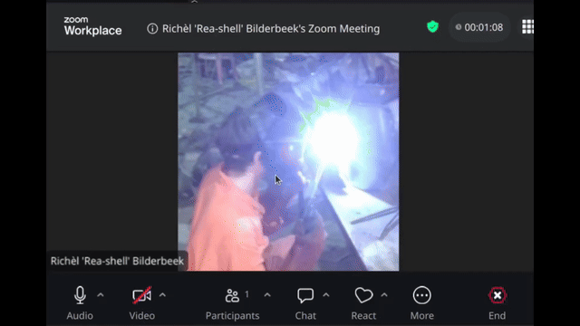

# create_animated_gif_from_video

These are my notes to create an animated GIF from a video

## Video recording

I made a regular full-screen screen recoding with OBS Studio.

This resulted in [this raw video](zoom_yes_no_raw.mp4)

## Video editing

I edited the video in Kdenlive.

The 'Edge Crop' tool does exactly what I want:
crop the screen to the region I want and create an output video
of the same resolution as that cropped region.

I rendered the edited video to the MKV format.

## Converting MKV 

Using [this script](create_gif.sh) I created the animated gif.

This is the result:

